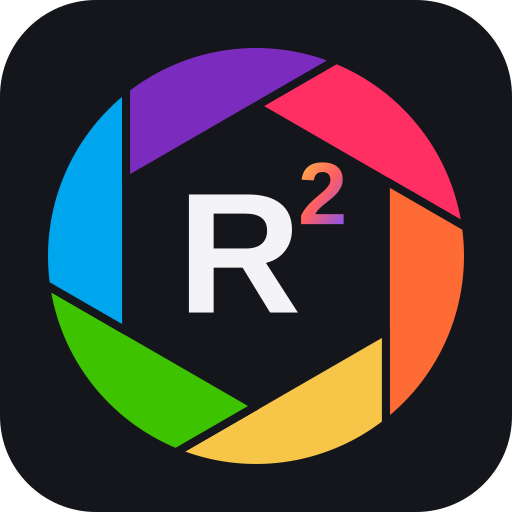

<p align="center">
  
</p>

<h1 align="center">RapidRoom</h1>

<p align="center"><b>The community build of <a href="https://github.com/CyberTimon/RapidRAW">RapidRAW</a>: a fast, GPU-accelerated raw photo editor, with the best work from across its community in one place.</b></p>

RapidRAW is a free, open-source raw editor by [Timon Käch (CyberTimon)](https://github.com/CyberTimon), and a great alternative to Lightroom. RapidRoom is the same app, kept close to upstream, plus the improvements that people building on RapidRAW have made in their own forks: tested together, credited to their authors, and offered back upstream.

## Highlights

<!-- rapidroom-changes:start -->

- **Reference View like Lightroom.** Pin one photo next to the one you are editing, then match the look while you move through the filmstrip.
- **A white balance picker you can trust.** It reads the untouched raw data, averages a square or a dragged area, and shows a live preview before you click, which helps with mixed-light night shots.
- **At home on Linux tiling desktops.** The native title bar works with Wayland compositors like Hyprland instead of fighting them.
- **Colour-managed exports.** JPEG, PNG and TIFF files carry an sRGB profile, so browsers, other apps and print labs show your colours as intended.
- **Sony lossless M/S and Canon mRAW/sRAW raws open correctly**, without the green borders upstream still shows.
- **Private and offline by default.** Nothing is contacted at startup except the update check: no Google Fonts, and the cloud sign-in service loads only if you use cloud features.
- **Your edits are safer.** Edits are saved crash-safe, a damaged mask no longer wipes out the others, and a corrupt panel layout no longer resets your settings.
- **Keyboard-friendly.** You can always see where keyboard focus is when you Tab through the app.
- **Reliable batch exports.** Large exports no longer slip another photo into some images, and colour and luminance masks now apply correctly when exporting.
- **Your keywords travel with your exports.** Tags you add show up as keywords in Lightroom, digiKam, photo sites and stock agencies.
- **Browse memory cards safely:** read-only Card mode never writes to the card
- **Star ratings you set in the camera show up in the library.**
- **Faster culling:** rate with 0–5 and jump straight to the next photo, and filter for exactly N stars.
- **Bring your Lightroom edits along:** import XMP sidecars

45 improvements on top of RapidRAW so far, including fixes for 17 upstream issues that are still open there. Every change, with its source and upstream status, is in the [changelog](../CHANGES.md).
<!-- rapidroom-changes:end -->

## Why RapidRoom

- **One home for the community's work.** RapidRAW has hundreds of forks, and many of them fix the same things separately. RapidRoom brings the best of them into one build that's tested against a pixel-exact regression set.
- **AI-assisted contributions welcome.** They're held to the same review and tests as any other change, and disclosed honestly. See [CONTRIBUTING](CONTRIBUTING.md).
- **Friendly with upstream.** We merge RapidRAW regularly and offer our fixes back as pull requests.
- **Credit where it's due.** Original authors stay on the commits and are listed in [CREDITS.md](../CREDITS.md).

## Install

There are no RapidRoom release builds yet, so build from source. You need [Rust](https://www.rust-lang.org/tools/install) and [Node.js](https://nodejs.org/), and on Linux the [Tauri prerequisites](https://tauri.app/start/prerequisites/):

```bash
git clone https://github.com/RapidRoom/rapidroom.git
cd rapidroom
npm install
npm run tauri build
```

For the full feature tour, tethering, the CLI and system requirements, see the [RapidRAW README](../README.md).

## Get involved

Bug reports, fixes and features from your own fork are all welcome. Start with [CONTRIBUTING](CONTRIBUTING.md). What's planned is on the [roadmap](https://github.com/orgs/RapidRoom/projects/1); questions and ideas go to [Discussions](https://github.com/RapidRoom/rapidroom/discussions). If you maintain a RapidRAW fork and want to help run RapidRoom, open an issue. See [GOVERNANCE](GOVERNANCE.md) for how decisions are made.

## Support upstream

RapidRoom exists because of RapidRAW. If you find it useful, please support CyberTimon on [Ko-fi](https://ko-fi.com/cybertimon).

## License

[AGPL-3.0](../LICENSE), the same as RapidRAW.

<sub>RapidRoom is an independent community project, not affiliated with or endorsed by CyberTimon or the RapidRAW project. Please report RapidRoom bugs here, not upstream.</sub>
