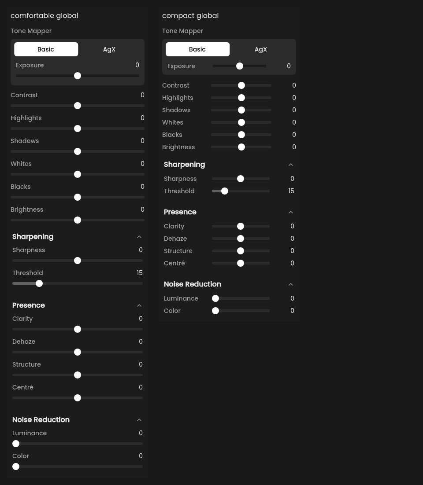
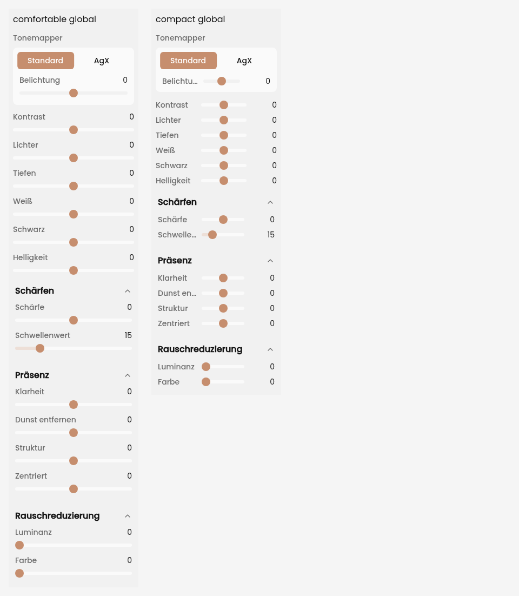
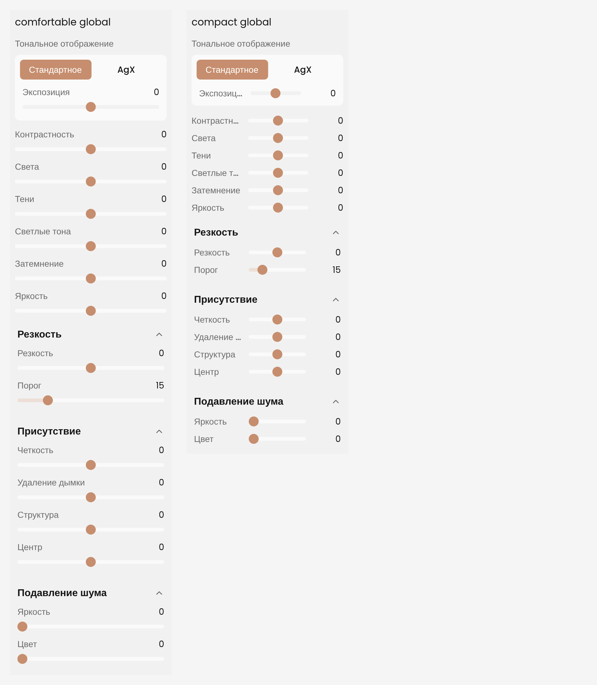
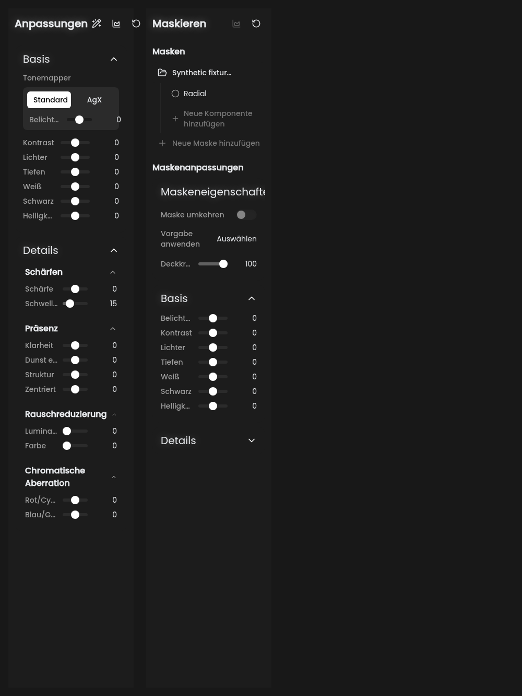
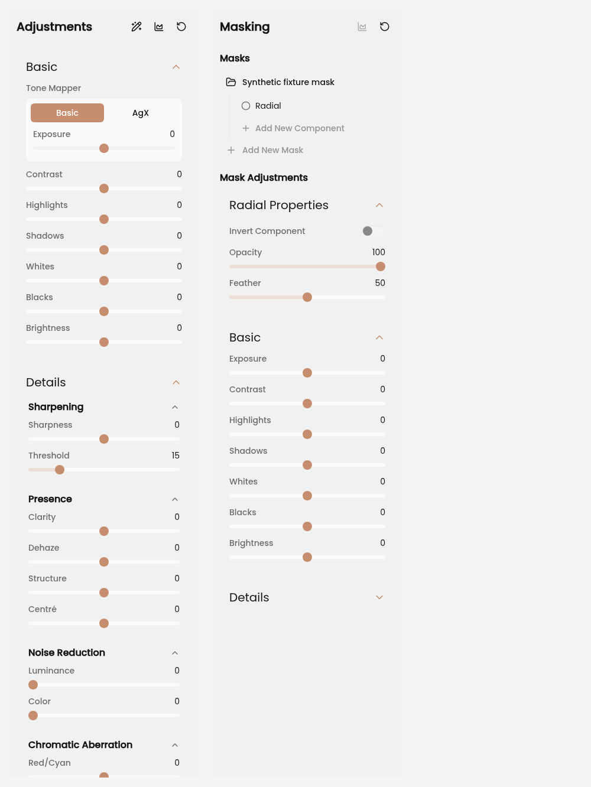

# Compact slider browser evidence

PR #109 / issue #81. These are headless Chromium screenshots of the actual React slider and adjustment components, with Poppins and the app themes/translations. The full-panel harness renders ControlsPanel and MasksPanel from a synthetic editor-store fixture; native preset loading returns an empty list. No photo, private data, native WebView or desktop interaction is shown.

- 48 layout scenarios: 240/260/320/420 CSS px, dark/light, English/German/Russian, 1×/2× display scale. Four default Slider DOM fixtures match the pre-change source exactly in each scenario. Ordinary Basic tracks align within their section; Exposure keeps the existing inset tone-mapper card.
- The English 320px Basic + Details fixture is 1070px tall in comfortable mode and 714px in compact mode (about 33% less). This is a measurement of these sections, not every possible panel.
- Both densities: a 40px drag changes Contrast by 26 steps; Alt and Shift reduce it to 5. Typed 12 plus ArrowUp commits 13, double-click resets, Shift-wheel changes one step. Arrow navigation retains its existing blur/shortcut behavior. Keyboard focus is a visible 2px solid outline. Horizontal touch changes 26 steps; vertical movement leaves the value unchanged.
- Truncated German labels keep their full tooltips at 240px. Accessible range and typed-field names are also covered by the Slider unit tests, including a React-node label.
- 24 full-panel scenarios cover both densities, 240/320/420px widths, 1×/2× scales and mask-container/radial-submask selection. All visible slider targets are at least 24px high and 47px wide. Mask opacity and radial feather use the shared Slider. The preset loader is the only mocked native call.

## Screenshots











## Reproduce

`browser_probe.mjs` and `fullpanel_probe.mjs` write temporary harness files, start Vite, run Chromium and remove the files/server in `finally`. Run sequentially from this checkout, with its existing npm dependencies, an installed Playwright Core module and Chromium. Set `PLAYWRIGHT_MODULE` to the module specifier or file URL if it is outside this checkout; `CHROMIUM_PATH` defaults to `/usr/bin/chromium`. `COMPACT_SLIDER_RESULTS` can point to an existing output directory; otherwise a temporary directory is created. No app dependency or system configuration change is required.

```sh
node rapidroom/validation/compact-sliders/browser_probe.mjs
node rapidroom/validation/compact-sliders/fullpanel_probe.mjs
```

These one-off browser probes supplement the committed native/frontend tests. Their JSON measurements are retained here. Human checks still cover native WebView focus, physical touch, panel-resizer gestures, the remaining slider consumers and native-speaker judgments of translations.
