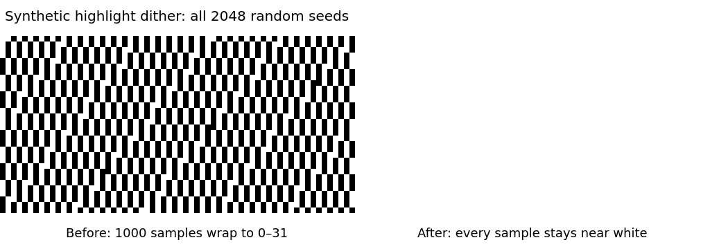
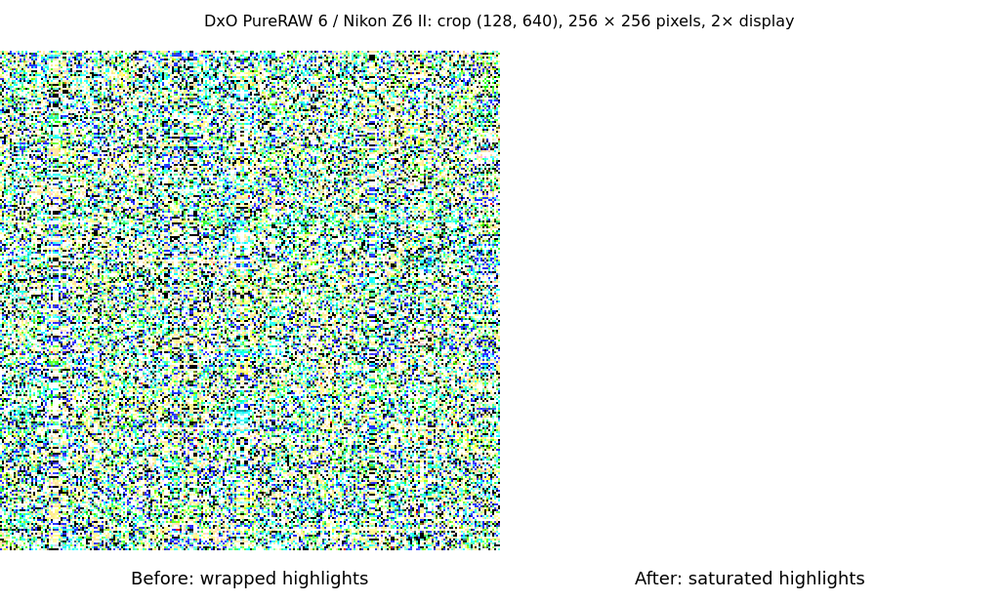
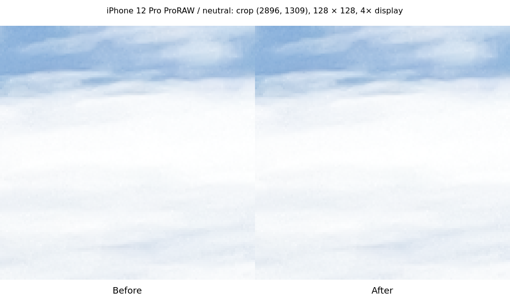
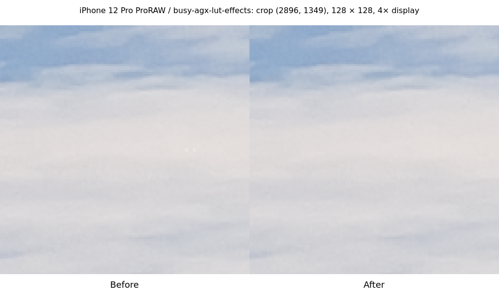
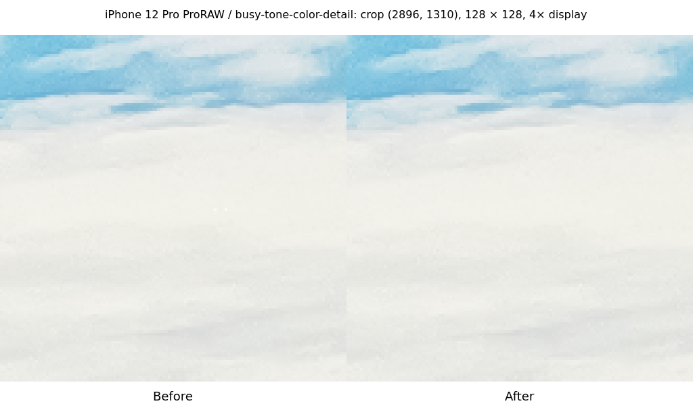

# Highlight dither overflow diagnostic

This is a synthetic diagnostic, not a photograph or an application screenshot. It shows the output of the exact before/after `LookupTable::dither` implementations on the final entry of `[65407, 65535]`, for every low-bit random seed from 0 through 2047. Samples are rearranged using `(index * 997) % 2048` to make the wrapped dark values visible.

The calculation starts from 65503 and can reach 65567. Before the fix, 1000 of 2048 samples wrap into 0–31 when converted to `u16`. After saturating the conversion, all outputs stay between 65503 and 65535. The random-state update is identical. Displayed pixels are enlarged with nearest-neighbor scaling; the labels describe the original 16-bit values.

The fork's regression tests cover every one of those seeds, representative unsaturated samples, and the random-state update. The real DxO PureRAW 6/Nikon Z6 II sample is tested separately below. Its RAW file and full photograph are not included in this repository.

## Real DxO sample

Both engines exported the same `DSC_5426.dng` (Nikon Z6 II, DxO PureRAW 6, JPEG XL compression) as an unadjusted 16-bit sRGB TIFF in fresh, isolated settings directories. Source SHA-256: `b28f8b3dd097f9b2b60016614b67b707eb6858041021db7acdc742f34725541b`.

The output is 4024 × 6048 pixels. Isolated dark highlight pixels fell from **82,031 to zero**, and all 82,031 became bright. The diagnostic defines dark as mean RGB below 8192 with the eight-neighbor mean above 49152; bright means above 49152. Edges are excluded. Overall, 2,056,903 output pixels changed (8.4517%). These are diagnostic measurements, not a claim that every changed pixel was an isolated black dot.

The displayed 256 × 256 crop begins at (128, 640) and contains 2,956 corrected dark pixels. It is enlarged 2× with nearest-neighbor scaling, with before on the left and after on the right.

## CC0 regression corpus: every difference explained

All 60 exports succeeded. The strict pixel-exact comparison exited 1: **57 identical, three changed**, all three presets of the same iPhone 12 Pro ProRAW DNG. Same environment, sizes and sRGB profiles; the committed reference was verified and was not updated.

To investigate, the same probe was linked separately against the already-built old and new production decoder libraries and decoded that file. Exactly **two of 36,578,304 decoded channel samples** changed, both green: (1374, 44) and (1374, 48), in the unrotated 4032 × 3024 RGB data. Both were 0 before and 65535 after; every other decoded sample was identical. This is the same overflow correction, also affecting this linear DNG. Rotation and the existing processing stages spread those corrections across a small number of output pixels.

| Preset                 | Changed output pixels | Max absolute 16-bit channel difference |
| ---------------------- | --------------------: | -------------------------------------: |
| neutral                |                    31 |                                    160 |
| busy-agx-lut-effects   |                   501 |                                   2272 |
| busy-tone-color-detail |                   350 |                                   3488 |

The previous release engine was then used to export this file with all three presets again: all three matched the committed reference exactly. A second export with the new release engine matched the full new corpus run exactly in all three presets. The differences are reproducible consequences of the two corrected samples.

These CC0 crops surround each preset's largest difference, are 128 × 128 pixels enlarged 4× with nearest-neighbor scaling, and show before on the left and after on the right. The captions give crop coordinates in the rotated 3024 × 4032 output.

Exact sample, engine and pixel hashes, comparison metrics and coordinates are in [measurements.json](measurements.json). Evidence was added after native validation; Rust and frontend trees were unchanged. Human visual sign-off remains pending. This evidence does not replace or approve an update to the regression reference.
