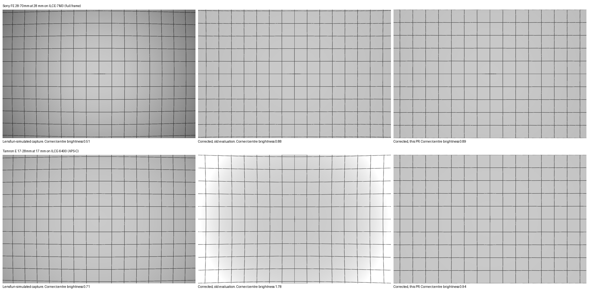

# Lensfun evaluation: before and after (#73)

No redistributable raw with a matching lens profile was at hand, so this uses a synthetic chart. The lens is simulated by Lensfun itself, not by RapidRoom:

1. `simulate_lens.cpp` draws a straight grid on a flat grey field and runs it through the Lensfun C++ library (git master, 0.3.99) in reverse mode. That adds the distortion and the vignetting of the bundled profile, as the lens would record them: left column.
2. RapidRoom's `warp_image_geometry`, the CPU path the app uses for lens correction, corrects that image twice: with the values an older version stores (no radius scale, middle column) and with the values this PR resolves (right column). Lens settings are the defaults (100 %); TCA is off, because the chart is grey. This step ran in a temporary test that isn't committed.

What it shows:

- **Sony FE 28-70mm at 28 mm on a full frame body.** The old evaluation over-corrects: the barrel distortion turns into a wavy pincushion at the edges. This PR gives straight lines.
- **Tamron E 17-28mm at 17 mm on an APS-C body.** The profile was calibrated on full frame. The old evaluation applies the full frame vignetting to the APS-C corners as if they were full frame corners, so the corners come out almost twice as bright as the centre (corner/centre 1.78). This PR rescales the profile to the sensor (0.94).
- The remaining darkening in the right column (corner/centre 0.89 and 0.94, not 1.00) is RapidRoom's existing choice: the vignetting slider at 100 % applies 80 % of the profile's gain. This PR doesn't change that.

Corner/centre is the mean brightness of the grey cells in the top left corner divided by the centre.

The exact agreement with Lensfun is checked by the unit tests `lensfun_oracle_distortion` and `lensfun_oracle_vignetting` (see `src-tauri/tests/lensfun_oracle/`).
