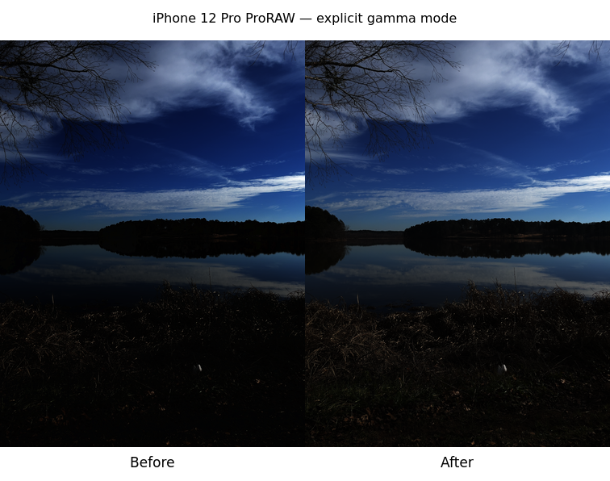
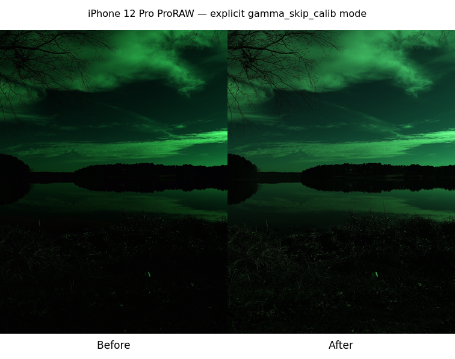

# LinearRaw sRGB exponent validation

The inverse transfer function now uses exponent 2.4, matching [W3C's sRGB conversion code](https://www.w3.org/TR/css-color-4/#color-conversion-code). Its threshold and linear segment are unchanged. This correction is used only for LinearRaw files in the explicit `gamma` and `gamma_skip_calib` modes. Default `auto`, `skip_calib`, Bayer and X-Trans files do not invoke this inverse-transfer branch.

## Controlled numerical tests

Two tests check fixed reference values and continuity at the segment join. Both fail using the exact previous production function and both pass using the corrected function. For input 0.5, the expected linear value is 0.21404114. At 0.04045, the expected value is 0.003130805; crossing to 0.040451 must not introduce a large jump.

## Real LinearRaw exports

The CC0 iPhone 12 Pro ProRAW file was exported with both modes explicitly selected in isolated settings directories. The source SHA-256 is `e91e77a4533ed7cce551d83330676ea5c47dd5e55fb38adda7819366afdbdfc2`. Both before/after commands succeeded, retaining 3024 × 4032 output and sRGB profiles. The explicit mode overrides were verified to differ from the default `auto` output.

| Mode             |          Changed pixels | Mean RGB before → after (16-bit) |
| ---------------- | ----------------------: | -------------------------------: |
| gamma            | 11,908,244 / 12,192,768 |               8227.45 → 11967.50 |
| gamma_skip_calib | 11,692,980 / 12,192,768 |                4305.63 → 7130.33 |

These are resized application exports, before on the left and after on the right. The modes were chosen to exercise the optional conversion branch. The `gamma_skip_calib` mode retains its existing calibration skip and corresponding color cast. These examples do not recommend either mode for this camera file. RAW files and full-resolution exports are not committed.

## Default 60-image corpus

Both a controlled sRGB-only build and the final #15 release export all 60 cases identically to the validated #17 build. Against the original committed reference, 57 are identical and the same three ProRAW cases differ because of the preceding #17 dither correction. This exponent fix adds no default-corpus differences. The reference is verified and unchanged.

Native validation and exact hashes are recorded in `measurements.json`. Human visual sign-off and explicit reference approval remain required before merge. Windows/macOS and running-app interaction were not tested.
