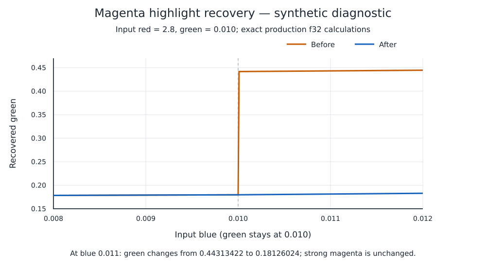
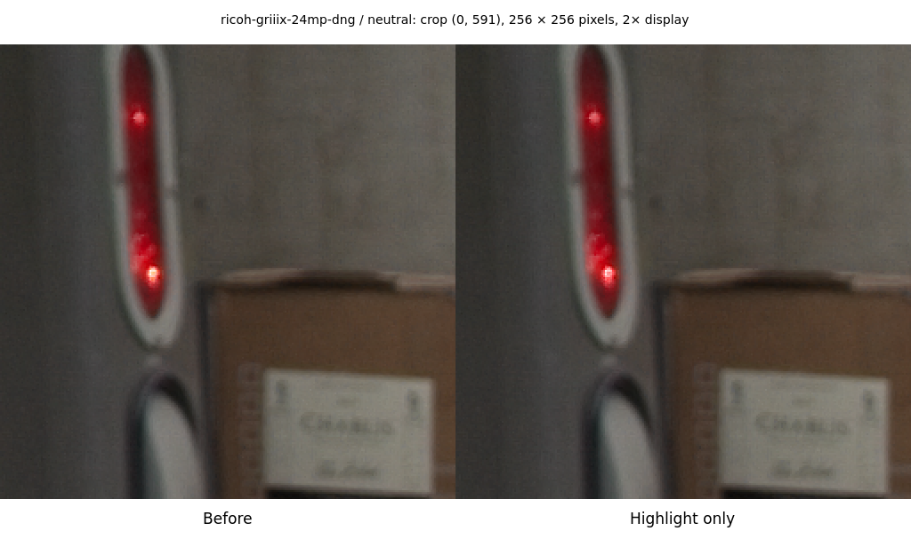
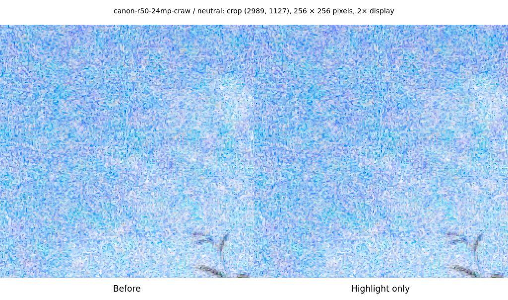
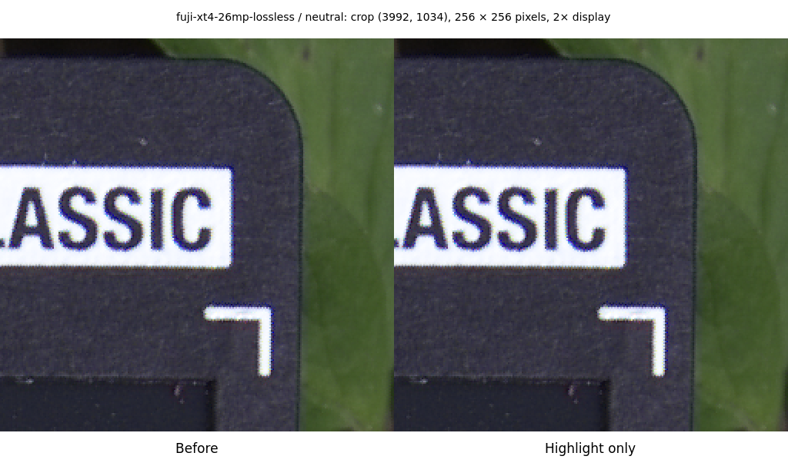
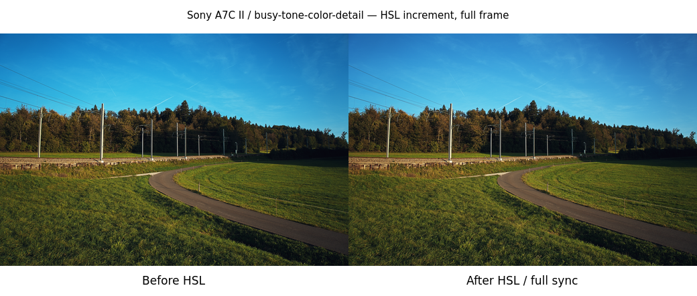
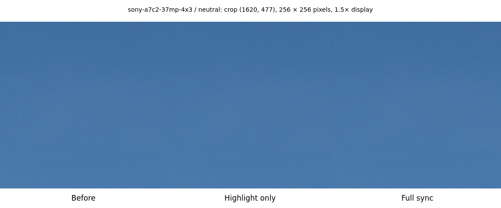
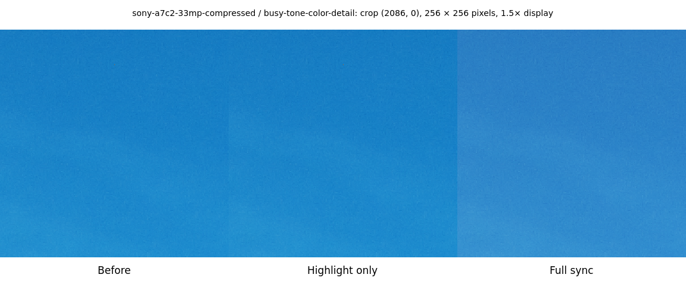
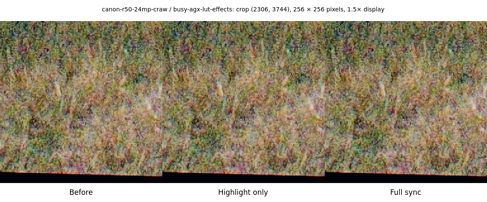

# Initial upstream sync: per-commit rendering evidence

**Final follow-up:** [Inactive HSL and positive-vibrance correction](hsl-noop/README.md) supersedes the unfixed rendering results below. It records the root cause, minimal fix and final 60-case comparisons. The following evidence describes the initial sync through `b19e4a47`, before the two local corrections.

This normal merge takes upstream main through `0957a1ae31248e46196e24c0fe81b92f71f9f69d`. The rendering changes are continuous magenta-highlight recovery and perceptual-space HSL hue/saturation. RapidRoom's existing rawler crop/dither fix and other protections remain. The additive EXIF conflict preserves both bounded rating readers and the incoming lens helper. The optional inverse-sRGB exponent fix is separate in #15.

## Attribution method

The baseline is the validated #17 engine, freshly exported and checked to reproduce all its 60 outputs. The highlight control includes the new recovery function and the optional inverse-sRGB fix; an independently compiled sRGB-only control reproduces all 60 baseline outputs, proving that optional conversion is unused by these default-auto corpus cases.

A second control starts from the **normal upstream merge** and reverts only the two-line HSL commit. Its 60 outputs are pixel-identical to the highlight control. This establishes that the other incoming commits together add no pixel differences in this corpus. The final sync is then compared with the highlight control to measure the HSL increment. This is a highlight-first/HSL-second attribution order; case counts overlap and must not be summed.

| Comparison                                     | Identical | Changed |
| ---------------------------------------------- | --------: | ------: |
| Highlight control vs validated #17             |         5 |      55 |
| Normal sync minus HSL vs highlight control     |        60 |       0 |
| Full sync vs highlight control (HSL increment) |         0 |      60 |
| Full sync vs validated #17 (overall delta)     |         0 |      60 |
| Full sync vs original committed reference      |         0 |      60 |

The original reference hashes were verified; the reference has not been updated. The preceding #17 dither fix already changed three ProRAW reference cases. `measurements.json` records per-image hashes and separate highlight/HSL/overall change flags so inherited changes and overlap are visible.

## Incoming commits

| Commit                                                                                             | Original author | Change                                                                  | Measured corpus increment                               |
| -------------------------------------------------------------------------------------------------- | --------------- | ----------------------------------------------------------------------- | ------------------------------------------------------- |
| [cf6813f1](https://github.com/CyberTimon/RapidRAW/commit/cf6813f198a252068eaa349eec7598d6761e830a) | Timon Käch      | fix stale export cache                                                  | 0 additional cases in the combined other-commit control |
| [e8834210](https://github.com/CyberTimon/RapidRAW/commit/e8834210d9c88793b463f4feca3b6e5ee3f65e55) | marclaliberte   | fix(color): compute HSL mixer hue in perceptual space                   | 60 changed cases                                        |
| [c11c7a5c](https://github.com/CyberTimon/RapidRAW/commit/c11c7a5c8d0c78b9f28175a377c53a6569aebe53) | marclaliberte   | fix(exif): read Nikon lens from MakerNote when EXIF has none            | 0 additional cases in the combined other-commit control |
| [43248097](https://github.com/CyberTimon/RapidRAW/commit/432480973061898dd04fa3d04119bd02d6bd372f) | marclaliberte   | refactor(thumbnails): share embedded preview fallback with image loader | 0 additional cases in the combined other-commit control |
| [4e45e620](https://github.com/CyberTimon/RapidRAW/commit/4e45e6206fb63d37dd5e2764db8a134a79d2034c) | marclaliberte   | fix(thumbnails): use rawler embedded preview for non-TIFF raws          | 0 additional cases in the combined other-commit control |
| [9671795e](https://github.com/CyberTimon/RapidRAW/commit/9671795e65803df4fc75239d752ddd16b829345b) | marclaliberte   | fix(masks): run custom Escape handler instead of storing a wrapper      | 0 additional cases in the combined other-commit control |
| [e99082ad](https://github.com/CyberTimon/RapidRAW/commit/e99082ad1d3cfea3db1f3e6611340f024f664258) | 3048mm          | fix(raw): make magenta highlight correction continuous                  | 55 changed cases                                        |
| [d6cda855](https://github.com/CyberTimon/RapidRAW/commit/d6cda855a5e250480b281cc681ab2f3cb04f478c) | VailElla        | perf(gpu): avoid float image copies during upload                       | 0 additional cases in the combined other-commit control |

All upstream authors and co-author trailers remain in merge history. The existing float-upload change deduplicates. Zero corpus differences does not assert that thumbnail loading, Nikon lens display, Escape actions or stale-cache reuse were tested. The cache fixes can correct previously stale rendered masks or exports outside this corpus.

## Highlight recovery

This synthetic diagnostic runs the exact old/new production `recover_clipped_pixel` functions as f32 code. R is 2.8, G is 0.010 and B varies from 0.008 to 0.012 in 401 steps. No photograph, GPU or tonemapping is involved. At B=0.011, recovered green changes from 0.44313422 to 0.18126024, removing the abrupt lift across B=G. The strong-magenta tuple remains exactly (2.22, 2.1037421, 2.0908246). The empirical full-weight relative-magenta threshold remains 0.25.

The exact old function fails the continuity test and passes the preservation test. The incoming function passes both. A fixed dark input is unchanged as well.

These CC0 crops isolate the highlight stage, before on the left and highlight-only on the right. Each 256 × 256 crop is displayed at 2× nearest-neighbor size. They were selected from the three neutral cases with the largest single-channel pixel differences, at the maximum-delta location. Whole-image changed fractions are 0.3130% for Ricoh, 16.6350% for Canon R50 and 0.4181% for Fuji X-T4. The Ricoh LED hotspot has less orange/white spill in the highlight control. The Canon crop shows noisy blue sky and the Fuji crop shows a high-contrast label; these illustrate affected pixels rather than proving visual preference.

## HSL increment and full sync

The HSL shader converts linear RGB to sRGB before extracting hue/saturation, converts back after the adjustment, and retains the linear-luminance rescale. The function is called even when HSL adjustments are zero, so neutral cases can have conversion-roundtrip differences; the measurement does not assume those cases are unchanged.

This full-frame pair isolates the HSL increment: the highlight control is on the left and the full sync is on the right. It is resized from the actual 16-bit sRGB exports with nonzero HSL settings in the busy-tone preset.

These three-stage CC0 crops show the validated #17 baseline, highlight-only control and full upstream sync. For each preset shown, the camera case with the largest mean HSL increment was selected; its crop is centered at the maximum HSL pixel difference. Each 256 × 256 crop is displayed at 1.5× nearest-neighbor size.

| Preset                 | HSL increment: changed cases | Maximum absolute 16-bit channel difference | Largest mean absolute channel difference |
| ---------------------- | ---------------------------: | -----------------------------------------: | ---------------------------------------: |
| neutral                |                      20 / 20 |                                         32 |                                 0.000691 |
| busy-tone-color-detail |                      20 / 20 |                                      50183 |                               819.521798 |
| busy-agx-lut-effects   |                      20 / 20 |                                      30575 |                                 0.067734 |

The AgX/LUT/effects preset has zero explicit HSL adjustments but includes sparse large pixel differences after the HSL change. Its largest per-case mean difference is only 0.067734 of a 16-bit code, while its maximum single-channel difference is 30,575. These outliers are included in the three-stage evidence and exact measurements; they are not discarded or described as ordinary small rounding errors. The control attributes them to the HSL commit, but this measurement does not isolate which downstream stage amplifies the input change. The most affected mean-difference case (Canon R50) was exported again with the same pinned engine and is pixel-identical to the first run, confirming reproducibility for that case. Human visual judgment is required.

## Validation and pending human checks

Formatting, strict locked Clippy across all targets/features, 123 library tests (one ignored), and the locked release build passed. Builds use four jobs and nice 10; builds, probes and application exports use the shared lock. Each engine was pinned inside its build lock before the next variant could overwrite the shared release path.

Scoped Prettier passed. The changed TSX files retain identical ESLint diagnostics to the base. Full TypeScript retains the same 46 inherited errors after normalizing line/column shifts. Linux/Omarchy kernel 7.2.5, Intel PCI 8086:64A0 with xe, Mesa/vulkan-intel 26.2.2; 20 CC0 RAW modes across nine camera brands, three presets each.

Windows/macOS, running-app interactions, embedded-preview fallbacks, lens display and cache-reuse scenarios were not tested. The optional additional DxO retention export was skipped at the maintainer's instruction because its old RAW fixture was deleted during cleanup and its source was not recorded; the saved #17 proof remains unchanged. RAW files and full-resolution exports are not committed. Exact engine/source hashes, control comparisons, environment and per-image changes are in `measurements.json`.

**Human visual sign-off on both rendering changes and explicit reference re-blessing are required before merge. The reference remains unchanged.**
