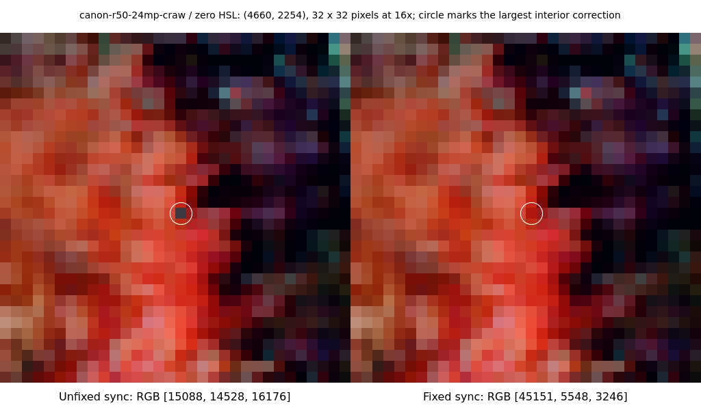
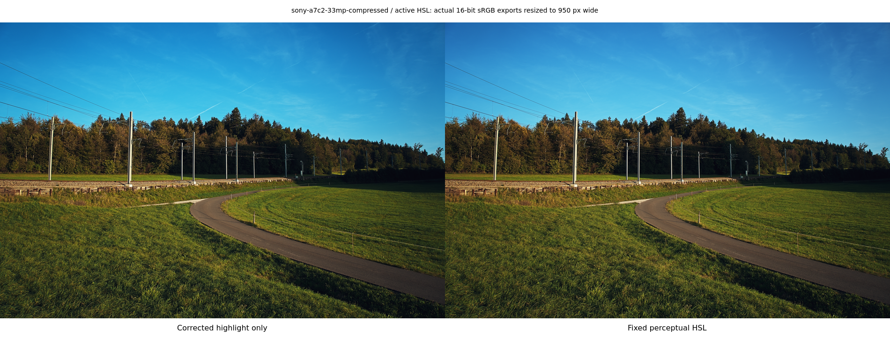

# Inactive HSL and positive-vibrance correction

This is the final follow-up to the [initial upstream-sync evidence](../README.md). The original `b19e4a47` measurements and photographs are retained as historical evidence; they describe the unfixed sync. The fixed native source is `0bc16e3e33b2e5f1da1d43f383442d5b956d51d4`. No reference has been blessed or changed.

## Root cause

The HSL mixer uses extended-sRGB/HSV, not Oklab. It ran even when all eight effective hue/saturation/luminance bands were zero. The upstream perceptual conversion changed the round trip's numerical RGB values. Both the legacy and incoming implementations also clipped negative channels before conversion. Values above 1 were not upper-clamped. AgX and LUT processing run afterward, so they do not supply the HSL input.

The large sparse outliers come from a pre-existing downstream **positive-vibrance power-domain bug**. `rgb_to_hsv` can round fully saturated HSV to 1.0000001192092896. Positive vibrance evaluated `pow(1.0 - current_sat, 1.25)` with a negative base. On this Intel/Mesa adapter the affected pixels collapse to equal-channel grey. The altered zero-HSL round trip moves saturated pixels into or out of that failure. This explains why both old and new paths can exhibit grey pixels. [WGSL's floating-point accuracy rules](https://www.w3.org/TR/WGSL/#floating-point-accuracy) do not require exact division; [the power builtin](https://www.w3.org/TR/WGSL/#pow-builtin) is not a portable way to evaluate a negative base with a fractional exponent. The observed grey collapse is adapter-specific evidence, not a portable guarantee about invalid floating-point results.

The actual-production-WGSL probe uses 60,000 saturated input colours. The legacy-vs-perceptual zero-HSL paths followed by vibrance have **1,222 differences above 0.1 RGB**. For `(0, 0.0198473986, 0.9996546507)`, the incoming path returns grey `(0.0863699242, 0.0863699242, 0.0863699242)` with reported saturation 1.0000001192; the legacy path remains coloured with saturation 1.0. Random positive colours with a nonzero minimum did not show this large-difference failure. The [probe results](vibrance-isolation.json) retain exact f32 values.

In the actual Canon R50 export, removing only positive vibrance reduces the maximum legacy-vs-perceptual difference to **56/65535** and leaves **zero pixels above 4096 codes**. Removing AgX, LUT, grain, noise reduction or rotation does not eliminate the outliers. With CA, grain, LUT, noise reduction and rotation removed, disabling calibration reduces the maximum to 32 codes; calibration can drive a channel negative, and the subsequent clip produces a fully saturated colour. All measured isolation variants, including the unsuccessful ones, are retained in [effect-isolation.json](effect-isolation.json).

## Minimal fix and limits

- Check all eight **effective per-pixel** bands, including mask contributions. If every value is exactly zero, return original linear RGB before any clipping or conversion. Signed zero, negative channels and HDR values are preserved exactly. No epsilon or global-only shortcut is used.
- Clamp the positive-vibrance fractional-power base: `pow(max(1.0 - current_sat, 0.0), 1.25)`.

Active HSL retains the incoming perceptual hue/saturation calculation and its existing negative-channel clamp. The test confirms that active HDR output remains above 1 and preserves linear luminance. A range-preserving redesign for active negative-gamut colours would require a broader colour-policy change and is not included.

## Corpus controls

| Comparison                                | Identical | Changed |
| ----------------------------------------- | --------: | ------: |
| Fixed sync vs corrected highlight control |   40 / 60 | 20 / 60 |
| Fixed sync vs legacy highlight control    |    0 / 60 | 60 / 60 |
| Fixed sync vs unfixed upstream sync       |    1 / 60 | 59 / 60 |
| Fixed sync vs validated #17               |    0 / 60 | 60 / 60 |
| Fixed sync vs original reference          |    0 / 60 | 60 / 60 |

The **40 zero-HSL cases are pixel-identical to the corrected highlight-only control**: 20 neutral and 20 AgX/LUT/effects cases. The active-HSL preset changes 20 / 20 cases. The corrected control contains exactly the same inactive-HSL and vibrance fixes; only the two perceptual HSL conversion lines are reverted. Its [complete shader difference](corrected-highlight-control.patch) is provided.

The old highlight-only control itself performs a non-identity zero-HSL round trip and has the same vibrance bug. It was independently re-rendered and reproduces **all 60 earlier highlight-control hashes exactly**. Its differences from the fixed engine are reported honestly, rather than treating that legacy output as an exact-no-op reference. Pixel-exact comparison remains the gate; no tolerance was relaxed.

Per-image hashes and differences against both controls, the unfixed sync, validated #17 and the verified original reference are in [measurements.json](measurements.json). The initial source-commit attribution remains in [the historical measurements](../measurements.json); counts from different attribution orders overlap and must not be added.

This pair comes from the actual zero-HSL AgX/LUT/effects exports, unfixed sync on the left and fixed sync on the right. The 32-pixel crop is centered at this camera's largest interior correction (excluding 150 pixels at each edge to avoid the rotation border) and displayed at 16x nearest-neighbour size. A white circle marks the affected pixel without covering it. Exact coordinates are recorded in the measurements.

This actual 16-bit export pair shows the identically corrected highlight control on the left and the fixed perceptual-HSL sync on the right. Both use the nonzero-HSL busy-tone preset. They are resized to 950 pixels wide; this is the final active-HSL comparison.

## Validation and provenance

Rust formatting, locked strict all-target/all-feature Clippy, **123 library tests (three ignored)**, and the locked release build pass. The two new GPU tests are then explicitly run and both pass: bit-identical inactive RGB, active last-band handling, HDR/luminance preservation, and a separate deterministic 60,000-input fully saturated vibrance sweep. The baseline ignored test remains ignored. The isolated before/after GPU probe shows 1122 grey collapses before and **0 after** across its 60,000 cases. [Its exact results](gpu-before-after.json) include shader-source commits and the input SHA-256.

Fixed engine SHA-256: `1f7e39494f96f7a416ea3345389df3c134b63ab4d9848ba63a52312d4a2a5311`. Corrected-control SHA-256: `34e22ca3e1a8d0c7cf7c63d8f5edebf51d7bf27d950e2db4f7fb4acf2274cd35`. Both are copied inside their build lock, then used immutably for all 60 exports. Builds use four jobs and nice 10; native builds, probes and application renders use `/tmp/rapidroom-build.lock`.

The frontend is unchanged by this follow-up. The previous scoped ESLint/base comparison and full TypeScript comparison remain applicable (46 inherited TypeScript errors; no new diagnostics), and the release build also bundles the frontend successfully. Scoped Prettier passes for changed documentation/metadata.

Linux/Omarchy 7.2.5, Intel Lunar Lake PCI 8086:64A0 with xe, Mesa/vulkan-intel 26.2.2. The corpus is 20 CC0 RAW modes across nine camera brands, three presets each. Windows/macOS, running-app interaction, thumbnail fallback, lens display and stale-cache reuse remain untested.

The upstream commits retain their authors and Claude co-author trailers. The two local corrections and GPU tests are by yojen7 with Codex. Upstream issue/PR text and a minimal production patch are drafted locally only; no outside issue, PR, comment or author notification has been sent.

**This PR stays draft. Human visual approval of the final rendering changes and explicit reference re-blessing are required before merge.**
