# RapidRAW v1.6.5 integration review (#175)

Tested application commit `4bea590bbd66b074877cad96626b427783c6d9a0` merges upstream
`8387fc12097a541093d796bf216c6e831f9ba5c0` into RapidRoom main `99934b66`.
The normal merge retains original contributor history. These artifacts contain
only the CC0 regression corpus and source/measurement evidence; personal photos
and account credentials are excluded.

## What changed

Upstream Kelvin white balance, as-shot A/D65 interpolation, shared WB gains,
the extreme warm/tint floor, guided edge-aware tone adjustments, mid-scale
shadow/highlight detail and selective Whites are retained. RapidRoom's exact-zero
HSL behavior, independent color-section visibility and per-image/mask blur
scheduling are preserved. Current library flags, rating operators, curve
controls, AI-free controls and translations are reconciled with existing local
features. Successful metadata writes advance selections only once queued saves
and rollbacks settle; manual navigation remains authoritative.

Cloud auth requires explicit successfully persisted `aiProvider=cloud`. CPU is
the default, AI-free never mounts Clerk, and Clerk telemetry is disabled. The
existing update check remains. Live Cloud account sign-in/generation is untested.

## Measured result

Each production configuration exported all 60 images on Intel Arc 140V/Lunar Lake,
Vulkan/Mesa 26.2.2, Arch Linux. The exact profile has zero tolerance; no threshold
was relaxed. Default and `terminal,mcp` match **60/60 decoded-pixel exactly**.
Compared with frozen int7, **20/60 are exact and
40/60 change**. All 20 neutral recipes are unchanged.
The two busy recipes exercise upstream tone/WB changes. A separate corrected
frontend rebuild matched the earlier `113a9514` snapshot 60/60 exactly.

Largest per-image mean absolute difference is
3468.22 16-bit code values, maximum absolute
difference 47959; largest per-image mean dE00 is
14.056. Those maxima can come from different
images. Full60 measurements and pixel hashes are in the comparison JSON files.
This is a regression comparison, not a Lightroom accuracy or quality score.

**The frozen reference, reference manifest, bless log and tolerances were not
updated. Josh must inspect these changes before any re-bless or merge.**

## Attribution method and scope

Seven clean release controls cumulatively reverse each production change from
the tested application. Current UI/read-only metadata APIs and local safeguards
remain, and every control contains the same frontend metadata fix. Old-relative
WB intentionally lacks the new absolute-WB recipe mode. All controls render
the same 20 originals and three recipes; adjacent phases are compared using
original 16-bit decoded pixels. Each temporary TIFF is deleted only after its
metrics and hashes are recorded. Engines and input/reference files are guarded.

`control-patches/` reconstructs the cumulative reverse production controls from
the tested application, in `control-source.json` order. Controls are historical
production paths, not release candidates; final-code unit test bodies are not
run on them. Their release compilation and actual exports validate their paths.

| Restored production change                                        | Exact vs preceding phase | Largest mean increment (16-bit codes) | Max increment (16-bit codes) |
| ----------------------------------------------------------------- | -----------------------: | ------------------------------------: | ---------------------------: |
| Residual control vs int7 (all direct new rendering paths removed) |                    60/60 |                                 0.000 |                            0 |
| Kelvin WB (`9ba20c02`)                                            |                    20/60 |                              3446.649 |                        19103 |
| A/D65 interpolation (`11e20e77`)                                  |                    22/60 |                               910.110 |                         6528 |
| Shared WB gains (`28fa5120`)                                      |                    20/60 |                                 0.141 |                           64 |
| Extreme LMS floor (`73bc73f4`)                                    |                    60/60 |                                 0.000 |                            0 |
| Guided tone graph (`66fa1600`)                                    |                    20/60 |                              2684.164 |                        49495 |
| Mid-scale detail (`1cc99d56`)                                     |                    20/60 |                               562.440 |                        12127 |
| Selective Whites + CPU scale (`c91e0bf7`)                         |                    40/60 |                              1517.034 |                         4096 |

**The historical control matches int7 exactly on all 60 cases. There is no
unexplained residual in this corpus after removing the seven controlled paths.**
All 20 neutral cases are exact across every stage. The final attribution hashes
match the production comparison for all 60 cases.

The first row measures the residual control against int7; later rows isolate
one restored production increment. Effects can interact, so their differences
are not additive. Merge commits aggregate original commits and are not counted
again as separate pixel changes. The 61 incoming commits, one already-present
range commit and each original diff hash/classification are recorded in
`incoming-commits.json`.

The regular recipes use moderate relative WB offsets. Five separate absolute
WB probes compare the clamp-only adjacent controls, including 2000 K / +150 tint
and ordinary 6504 K / 0 tint. `wb-clamp-probes.json` reports actual exported pixels;
all four other probes (2000 K / -150 tint, 2000 K / 0 tint, 6504 K / 0 tint,
50000 K / +150 tint) are pixel-exact across both controls. At 2000 K / +150 tint,
the unclamped export is entirely black (mean code 0); the fixed export has
mean code 20255.52 and visible, strongly blue pixels. The floor does not change
any of the ordinary full60 cases.

| 2000 K / +150 tint, before LMS floor                            | After LMS floor                                                          |
| --------------------------------------------------------------- | ------------------------------------------------------------------------ |
|  | 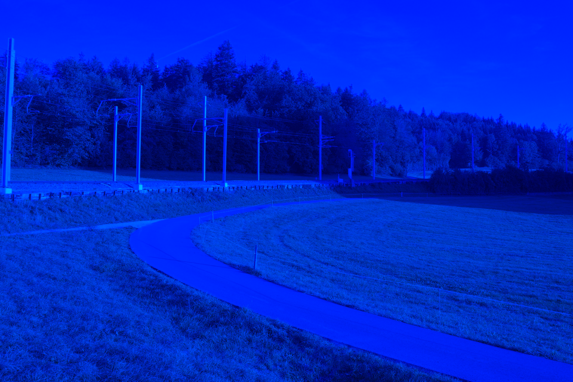 |

Automatic full60 does not cover interactive curve dragging/WB sampling, live
cloud generation, or newly generated AI masks. Five retained sampler Rust
regressions cover area sampling/linearization; cloud gate and AI-free controls
have frontend regressions. Existing mask/adjustment behavior is also exercised
by the native three-mask real-client smoke. These are explicitly different
checks, not extra full60 camera coverage.

## Validation and limitations

- Strict locked all-target/all-feature Clippy, Rust formatting: pass.
- Rust library tests: 317 default, 354 combined passed; 8 ignored in each.
  The complete Rust tree is identical between tested `113a9514` and the final
  application; `source-and-engines.json` records that equality.
- Frontend: 184 tests pass with four workers, including all 10
  original denoise cancellation/default-choice tests and separate AI-free cases.
- Scoped Prettier, generated adjustment schema and generated status: pass.
- Typecheck: 46 inherited diagnostics; lint: 923 inherited messages including
  warnings. Exact path/rule or code/source-line/multiplicity comparisons against
  both parents under merged dependencies introduce zero new diagnostics.
- i18n runtime check **fails** with 212 issues, exactly the pinned upstream result;
  main has 88 under merged dependencies. No integration-only failure.
- Native #134 minimum scenario: real thumbnail/preview, Exposure/Contrast edits,
  exact Undo, compact-slider persistence, full-size JPEG export and clean exit.
- Live Claude and Codex MCP clients: three masks, compact schemas, statistics,
  edit/history/preview checks pass. Optional QA loopback driver is present only
  in the dedicated native test-feature build; normal default/combined production
  engines are tested separately.
- Fresh default-launch CONNECT host logging and sampled TCP sockets: pass.
  Observed hosts: api.github.com.
  No observed Clerk/cloud/font hosts or sampled direct TCP bypasses; measurement
  duration 131.2s, 400 socket samples.
  This measures startup/edit/export traffic, not all packets or every future
  state. Cloud account sign-in/generation and non-Linux platforms are untested.
- Interactive terminal PTY use was not exercised in this native run.
- Codex inspected all ten public before/after panels and all five WB probe pairs.
  This agent inspection does not constitute human approval.
- No human visual/interaction approval has been received.

## CC0 before / after

Whole-image previews use the same 8-bit conversion and Lanczos downsampling
on each side, without exposure/contrast changes. Measurements use original
16-bit exports, not these presentation PNGs. URLs, licences and raw hashes
are in `cc0-sources.json`; preview/pixel hashes in `before-after-manifest.json`.

### sony-a7c2-15mp-uncompressed — busy-agx-lut-effects

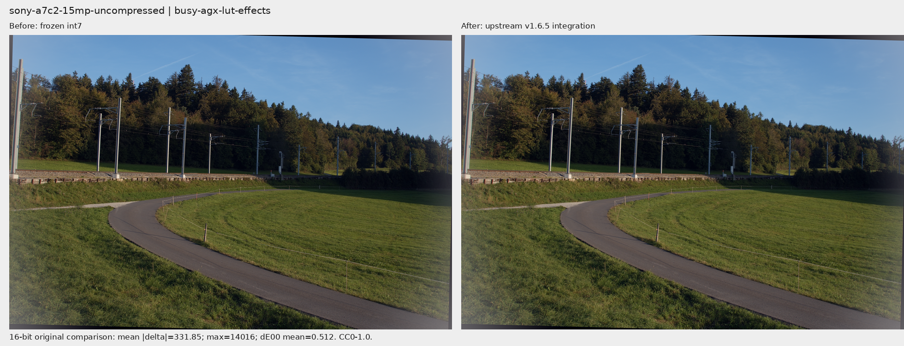

### om-om1-20mp — busy-agx-lut-effects

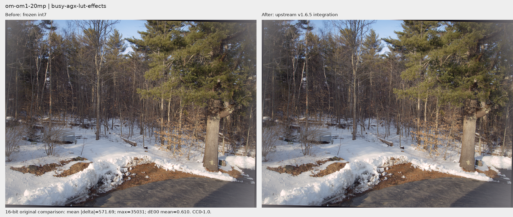

### apple-iphone12pro-proraw — busy-agx-lut-effects

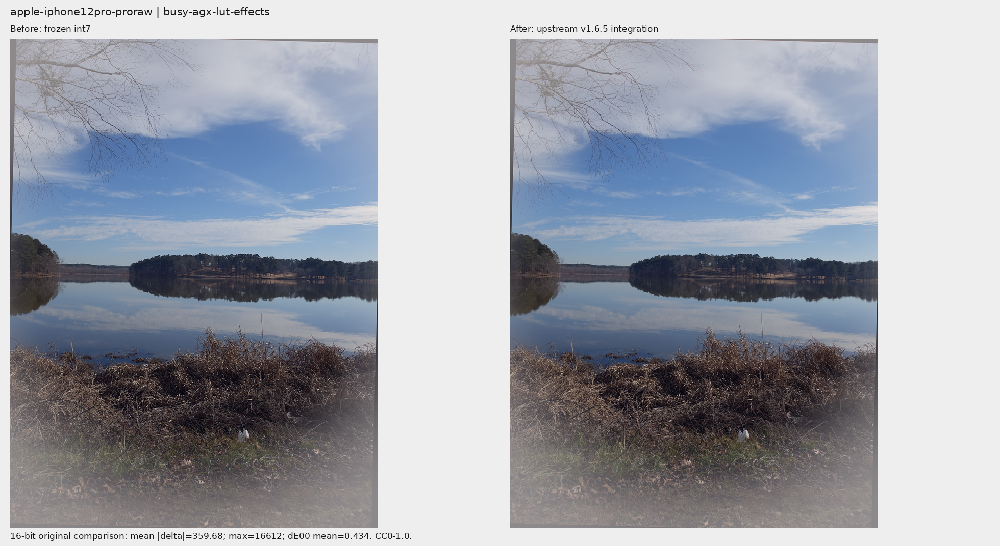

### sony-a7c2-15mp-uncompressed — busy-tone-color-detail

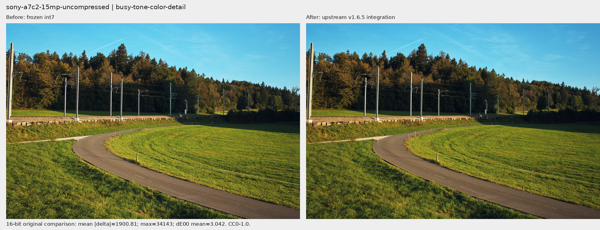

### om-om1-20mp — busy-tone-color-detail

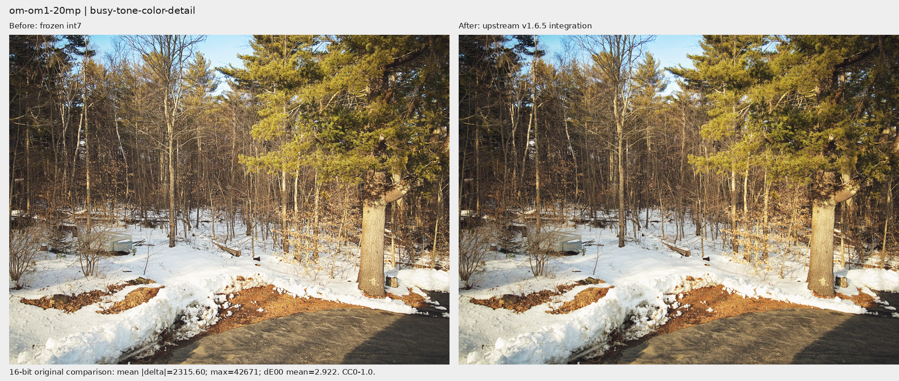

### apple-iphone12pro-proraw — busy-tone-color-detail

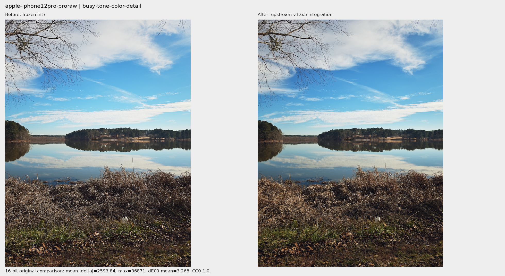

## Largest measured changes

These additional views show the corpus maxima, alongside the representative
Sony/OM-1/iPhone cases above.

**Review concern: the Sony A7CR 18 MP small-lossless raw has a strong magenta
cast in both busy recipes after integration.** Its mean dE00 is 14.056 in the
tone recipe and 8.252 in the AgX recipe. For this input the Kelvin WB increment
has mean absolute differences 3446.649 / 2714.990 codes; A/D65 interpolation
reduces the difference against int7 to 2539.374 / 1853.379 codes before later
tone changes. These measurements account for the changed production paths;
they do not establish that the resulting color is acceptable. Josh should
explicitly judge this camera case before accepting the WB changes.

### canon-r50-24mp-craw — busy-tone-color-detail

Selection: largest per-image mean absolute pixel difference.

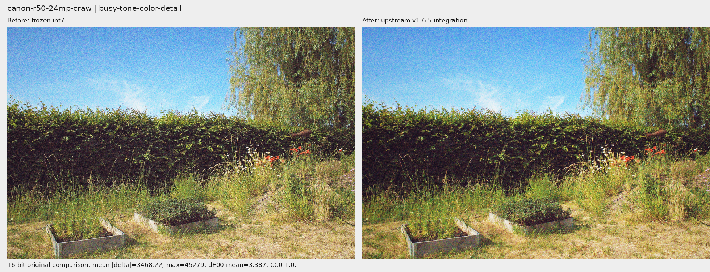

### sony-a7cr-18mp-lossless-s — busy-tone-color-detail

Selection: largest per-image mean dE00.

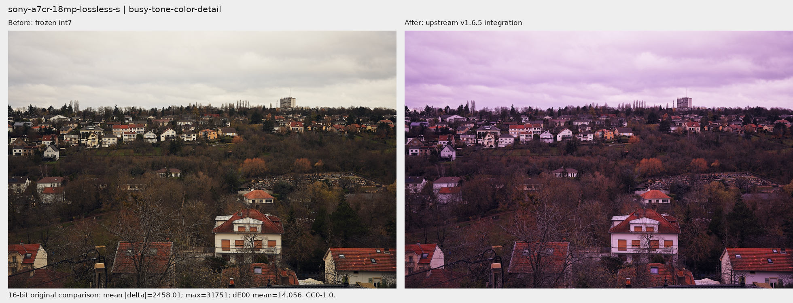

### sony-a7cr-18mp-lossless-s — busy-agx-lut-effects

Selection: second largest per-image mean dE00; other recipe for the same camera.

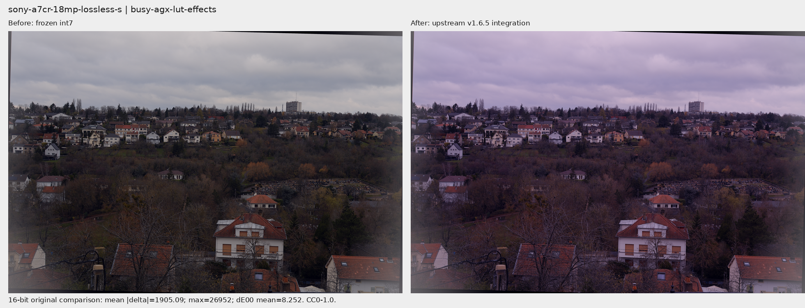

### fuji-xt4-26mp-lossless — busy-tone-color-detail

Selection: largest absolute pixel difference.

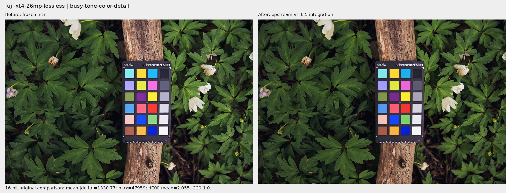

Written/reconciled by Yojen with Codex. Original upstream authors and licences
are retained; no upstream comments, submissions or outsider notifications were
sent as part of this integration.
